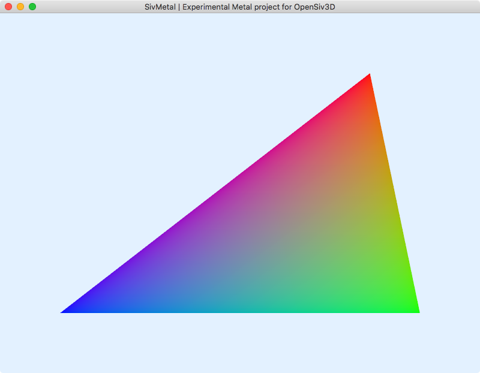

# SivMetal
An experimental Metal project for OpenSiv3D

## S01. Triangle

## S02. Shapes

## S03. Texture

## References

- :book: Metal Framework Reference | [Document](https://developer.apple.com/documentation/metal?language=objc)

- :book: MetalKit Framework Reference | [Document](https://developer.apple.com/documentation/metalkit?language=objc)

- :book: Metal Best Practices Guide | [Document](https://developer.apple.com/library/archive/documentation/3DDrawing/Conceptual/MTLBestPracticesGuide/index.html)

- :book: Metal Shading Language Specification | [PDF](https://developer.apple.com/metal/Metal-Shading-Language-Specification.pdf)

- :book: Metal Feature Set Tables | [PDF](https://developer.apple.com/metal/Metal-Feature-Set-Tables.pdf)

- :book: Metal Programming Guide | [Document](https://developer.apple.com/library/archive/documentation/Miscellaneous/Conceptual/MetalProgrammingGuide/Introduction/Introduction.html)

- What's New in Metal, Part 1 (WWDC15) | [Video](https://developer.apple.com/videos/play/wwdc2015/603/) | [PDF](https://devstreaming-cdn.apple.com/videos/wwdc/2015/6037pi9rxl6tfss8w/603/603_whats_new_in_metal_part_1.pdf)

- What's New in Metal, Part 2 (WWDC15) | [Video](https://developer.apple.com/videos/play/wwdc2015/607/) | [PDF](https://devstreaming-cdn.apple.com/videos/wwdc/2015/607g5z16fpl7pzgi/607/607_whats_new_in_metal_part_2.pdf)

- Metal Performance Optimization Techniques (WWDC15) | [Video](https://developer.apple.com/videos/play/wwdc2015/610/) | [PDF](https://devstreaming-cdn.apple.com/videos/wwdc/2015/610kn68riy9ms89m/610/610_metal_performance_optimization_techniques.pdf)
  
- Adopting Metal, Part 1 (WWDC16) | [Video](https://developer.apple.com/videos/play/wwdc2016/602) | [PDF](https://devstreaming-cdn.apple.com/videos/wwdc/2016/602o05a86ysk0ngvlgj/602/602_adopting_metal_part_1.pdf)

- Adopting Metal, Part 2 (WWDC16) | [Video](https://developer.apple.com/videos/play/wwdc2016/603) | [PDF](https://devstreaming-cdn.apple.com/videos/wwdc/2016/603oba298b1v4z54011/603/603_adopting_metal_part_2.pdf)

- What's New in Metal, Part 1 (WWDC16) | [Video](https://developer.apple.com/videos/play/wwdc2016/604) | [PDF](https://devstreaming-cdn.apple.com/videos/wwdc/2016/604oezpg3wmqrkxl0t7/604/604_whats_new_in_metal_part_1.pdf)

- What's New in Metal, Part 2 (WWDC16) | [Video](https://developer.apple.com/videos/play/wwdc2016/605) | [PDF](https://devstreaming-cdn.apple.com/videos/wwdc/2016/605ooaey8tbzegv8fth/605/605_whats_new_in_metal_part_2.pdf)

- Advanced Metal Shader Optimization (WWDC16) | [Video](https://developer.apple.com/videos/play/wwdc2016/606) | [PDF](https://devstreaming-cdn.apple.com/videos/wwdc/2016/606oluchfgwakjbymy8/606/606_advanced_metal_shader_optimization.pdf)

- Introducing Metal 2 (WWDC17) | [Video](https://developer.apple.com/videos/play/wwdc2017/601) | [PDF](https://devstreaming-cdn.apple.com/videos/wwdc/2017/601nzg4idodih222/601/601_introducing_metal_2.pdf)
  
- Metal 2 Optimization and Debugging (WWDC17) | [Video](https://developer.apple.com/videos/play/wwdc2017/607) | [PDF](https://devstreaming-cdn.apple.com/videos/wwdc/2017/607x3ix6ocbh8/607/607_metal_2_optimization_and_debugging.pdf)

- Metal for OpenGL Developers (WWDC18) | [Video](https://developer.apple.com/videos/play/wwdc2018/604) | [PDF](https://devstreaming-cdn.apple.com/videos/wwdc/2018/604lh97z18yv96g6nhf/604/604_metal_for_opengl_developers.pdf)

- Metal for Game Developers (WWDC18) | [Video](https://developer.apple.com/videos/play/wwdc2018/607/) | [PDF](https://devstreaming-cdn.apple.com/videos/wwdc/2018/607buro3d9jn66/607/607_metal_for_game_developers.pdf)

- Metal Shader Debugging and Profiling (WWDC18) | [Video](https://developer.apple.com/videos/play/wwdc2018/608/)

- Metal Game Performance Optimization (WWDC18) | [Video](https://developer.apple.com/videos/play/wwdc2018/612/) | [PDF](https://devstreaming-cdn.apple.com/videos/wwdc/2018/612wlpc4tnd47e9245/612/612_metal_game_performance_optimization.pdf)

